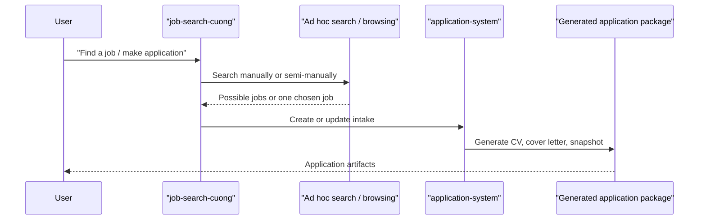
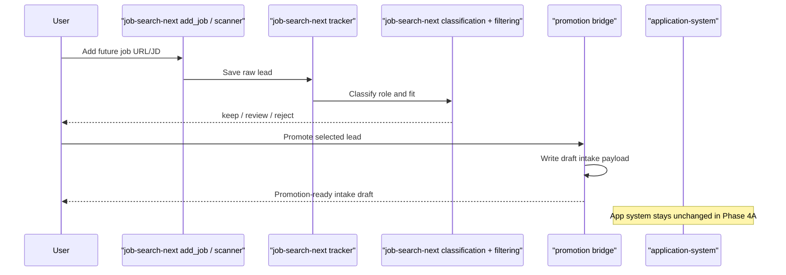
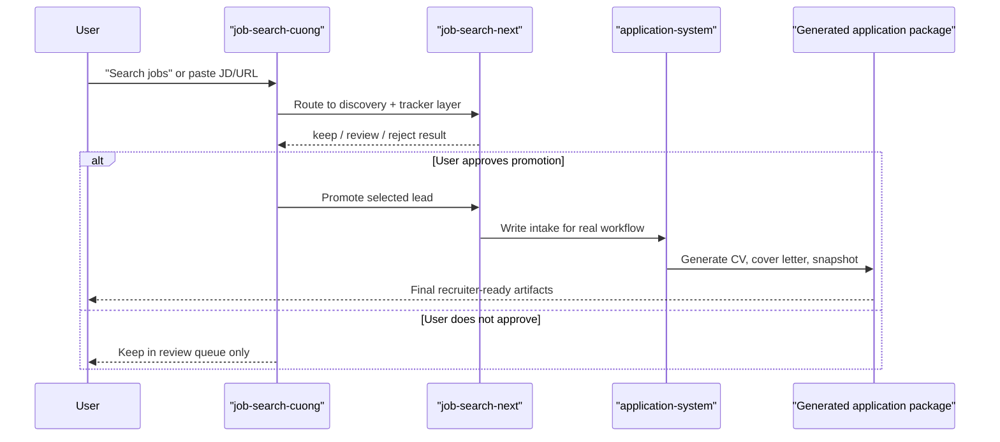
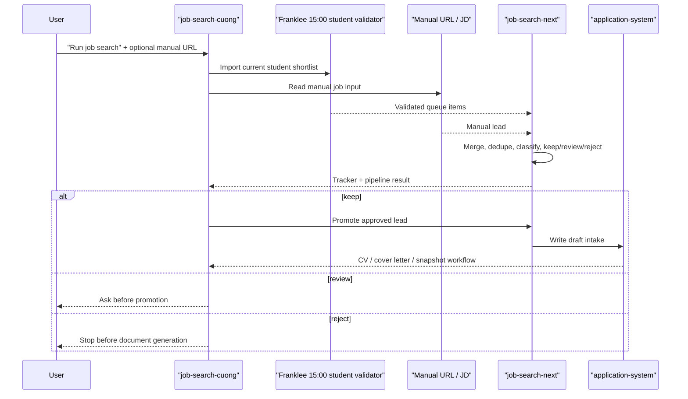

# Phase 4 Sequence Diagrams

This document shows the difference between the old workflow and the new workflow we are building.

## Old workflow

The old path is more direct but less structured.

Problem:

- search and filtering are mixed together
- no separate tracker-first stage
- no clean keep/review/reject funnel before document generation

## New workflow after Phase 4A

This keeps the current application engine, but adds a front-door controller.

## New workflow after full Phase 4B

This is the target operating model.

## Short explanation

Old workflow:

- search and apply are too close together

New workflow:

- collect lead
- classify it
- decide if it is worth attention
- only then hand it to the real application engine

Phase 4B in this repo now means:

- the live skill routes future job-search work into `experimental/job-search-next`
- approved promotions can write a real draft intake into `application-system/intakes/`
- the existing `application-system/` remains the generator and truth layer for application artifacts

## Queue-assisted workflow with Franklee 3 p.m. student source

This is the practical future workflow for manual job-search requests.

