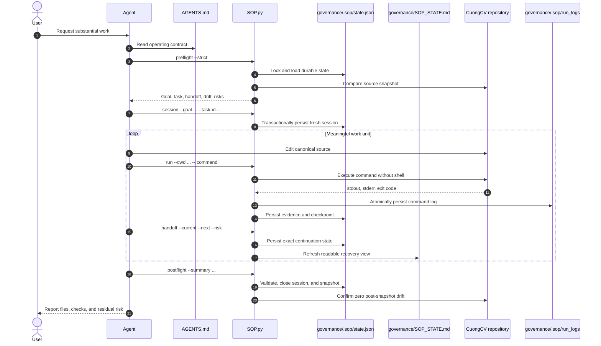
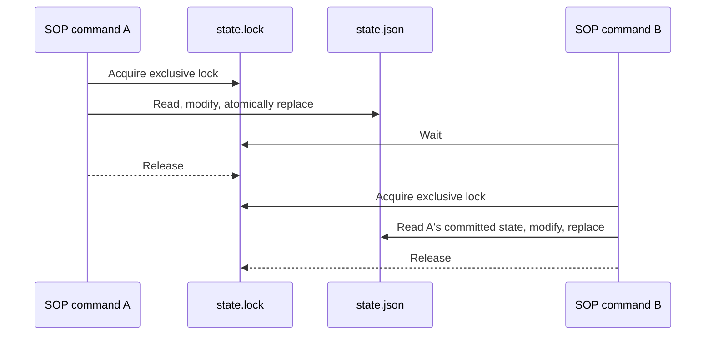

# CuongCV SOP Governance Sequence

## Substantial work

## Concurrent mutation protection

## Recovery rules

- Run `status`, `resume`, and `audit` after context compaction.
- Verify filesystem and generated artifacts before claiming completion.
- Use evidence-backed `kiro-done` for Kiro tasks.
- Use `--keep-session` only when deliberately continuing the same work.
- Update this document when the SOP command contract changes materially.
