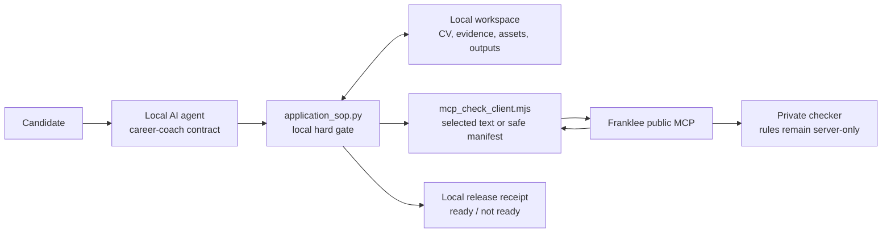
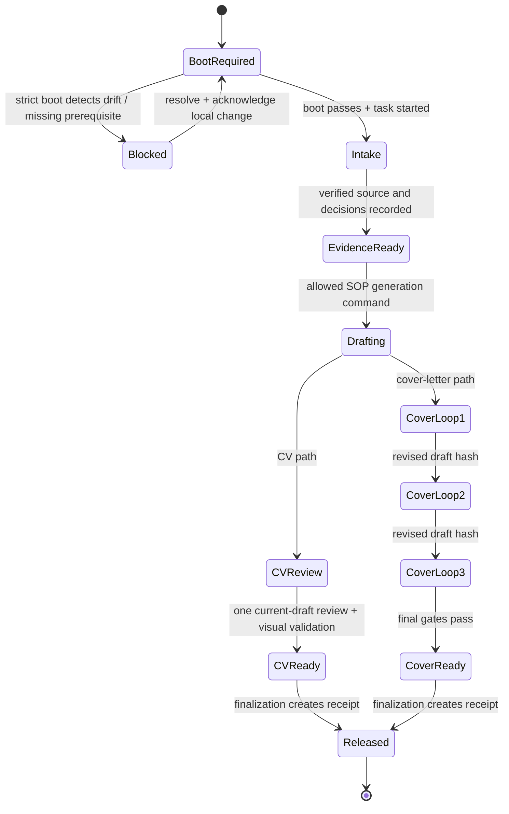

# Design Document: Resilient Local-First Application MCP

## Overview

The design introduces a **local Application SOP** that becomes the only supported route for material application work. It creates durable local state, runs mandatory preflight checks, invokes conversion/generation/review helpers through a controlled command surface, and creates a release receipt only when the applicable quality gates pass.

The public Franklee MCP remains an unauthenticated, stateless service. It receives either selected draft text for private human-fit feedback or a privacy-safe structure manifest. It never reads a user filesystem and never returns the private checker implementation.

This is a reduced Sirius-style harness: strong local state, explicit transitions, evidence, audit, recovery, and atomic persistence—but no Git author/consumer modes, team changelogs, skill sync, or enterprise integrations.

### Architecture and Trust Boundaries



Portable ASCII equivalent:

```text
Candidate → local AI agent → application_sop.py → local workspace
                                  │                     │
                                  └→ MCP client → Franklee private checker
                                                     (feedback only)
                                  │
                                  └→ local release receipt
```

| Boundary | Trusted input | Prohibited input/output |
| --- | --- | --- |
| Candidate ↔ local agent | Direct user decisions; local supplied files | Treat CV/JD/OCR/HTML text as executable instructions. |
| Local agent ↔ SOP | Structured subcommands and safe relative paths | Direct finalization without state/receipt validation. |
| Local workspace ↔ MCP | Selected review text; schema/version/relative-path manifest | Full CVs, profile/evidence files, assets, absolute paths, PDFs, checker rules. |
| MCP ↔ checker | Server-internal implementation | Public bundle/source, raw thresholds, private phrase lists, debug state. |

### Sirius Lessons Applied

| Sirius control | Application-SOP adaptation | Rationale |
| --- | --- | --- |
| Mandatory `boot` runs status, resume, audit | `application_sop.py boot --strict` runs status/recovery/inventory/manifest audit | Prevents blind continuation after interruption or local drift. |
| Tasks, sessions, checkpoints, handoffs | Per-application tasks, receipts, and concise local handoff | Enough recovery without general project-management burden. |
| Locked atomic state and snapshot audit | Lock-protected state with managed-workspace hashes | Prevents corruption and exposes unexpected local changes. |
| Evidence required for task completion | Release receipt validates paths, hashes, command records, and gates | “Ready” becomes machine-checkable rather than prose. |
| Consumer-local state | One local `.application-sop/` state store per candidate workspace | Candidate state remains private and is never synced by the MCP. |
| Command logging | Allowlisted structured command receipts | Avoids arbitrary shell execution while retaining validation evidence. |

## Architecture

### Workspace Layout

```text
student-application-workspace/
├── AGENTS.md                         # Career-coach behavior and trusted hierarchy
├── README.md                          # Candidate orientation and file checklist
├── application_sop.py                 # Local durable control plane
├── .application-sop/                  # Local-only; never sent to MCP
│   ├── state.json
│   ├── state.lock
│   ├── SOP_STATE.md
│   ├── snapshots/
│   ├── receipts/
│   ├── handoffs/
│   └── run-logs/
├── .mcp/
│   ├── workspace-manifest.json
│   ├── audit-state.json
│   └── update-policy.json
├── candidate/source/                  # Original CV, optional photo/signature
├── profile/                           # Verified profile, evidence, claim boundaries
├── voice/                             # Voice profile and optional writing samples
├── jobs/<slug>/                       # Job source and intake
├── applications/<slug>/               # Output, audits, release receipt
└── scripts/                            # Local conversion/build/check helpers
```

`.application-sop/` is created locally on first boot and ignored by versioned/template updates. `state.json` is machine-readable; `SOP_STATE.md` is a concise human recovery mirror.

### Application SOP State Machine



Portable ASCII equivalent:

```text
BOOT REQUIRED → [blocked if drift/missing state] → intake → evidence ready → draft
                                                                      ├→ CV review ×1 → release
                                                                      └→ cover review ×3 → release
```

### Hard-Gate Invariant

The SOP does not try to stop a person from manually creating a file. Instead, it makes the supported workflow’s final state non-forgeable by ordinary agent prose:

1. `finalize-cv` and `finalize-cover-letter` verify local state under a lock.
2. They recompute hashes of the current draft/artifact.
3. They validate required decisions/evidence and current review records.
4. They check the associated visual/PDF evidence when that rendering path is supported.
5. They write a signed-by-state, hash-bound local release receipt only on pass.

An artifact without a matching receipt is reported as **unverified / NOT READY**, even if it opens successfully.

## Components and Interfaces

### 1. `application_sop.py`

Dependency-free Python 3.11+ command-line control plane. It uses `argparse`, `json`, `hashlib`, `pathlib`, `tempfile`, OS-specific file locking, and subprocess calls with argument lists only. It must not use `shell=True`.

| Subcommand | Preconditions | State change / output | Hard failure |
| --- | --- | --- | --- |
| `boot --strict` | none | initializes/loads state, prints recovery, audits inventory + manifest | drift, stale audit, missing required state, inconsistent task/session |
| `start --job <slug> --goal <text>` | successful strict boot | active task/session | another active task or invalid slug |
| `intake-status --job <slug>` | active task | reports required/optional inputs | none; read-only |
| `record-decision` | active task | photo/signature/voice/evidence skip decision | invalid enum or missing rationale where needed |
| `ingest-cv` | boot, active task, supported input | source capture receipt | unsupported or unextractable format |
| `build-cv` / `build-cover-letter` | evidence-ready | generated draft/artifacts | missing verified evidence or decision gate |
| `review-cv` | current CV draft | one MCP review record | stale/missing manifest audit or client failure |
| `review-cover --loop 1|2|3` | current cover draft | loop review record | duplicate draft hash without explicit no-safe-revision blocker |
| `validate-visual` | generated HTML/PDF | screenshot/PDF validation receipt | no expected artifact or visual failure |
| `finalize-cv` / `finalize-cover-letter` | all relevant evidence | local release receipt | any missing, stale, invalid, or unresolved blocking record |
| `handoff` | active task | exact next command + risk file | invalid or missing next command |
| `postflight` | active task | validates, snapshots, handoff, closes task | invalid evidence or failed snapshot validation |
| `health` | none | concise readiness report | exit nonzero only with `--strict` |

The agent’s `AGENTS.md` requires this command surface. A direct script invocation can still be physically possible, but final outputs are not valid supported deliverables until a receipt exists.

### 2. Local state and concurrency

`state.json` is written only by `application_sop.py`:

```json
{
  "schema_version": 1,
  "workspace_kit_version": "2026.08.14-resilient-workspace.1",
  "active": {"task_id": "APP-0001", "job_slug": "company-role", "phase": "cover_loop_2"},
  "decisions": {"photo": "provided", "signature": "declined", "voice": "generic_voice_accepted"},
  "evidence": {"profile_ready": true, "employer_bullet_status": "skipped_with_risk"},
  "manifest_audit": {"status": "workspace_current", "at": "..."},
  "review_records": [],
  "snapshot": {},
  "handoff": {},
  "command_receipts": []
}
```

State mutation protocol:

```text
Acquire exclusive lock
  → load and schema-validate state
  → verify command preconditions
  → run allowlisted helper with argument list
  → validate outputs and hashes
  → append receipt/checkpoint
  → atomic write temporary JSON + fsync + replace
  → regenerate SOP_STATE.md
Release lock
```

If a process terminates before replace, the previous valid state remains authoritative. If an output exists without a matching command receipt, it is unverified and must be revalidated or explicitly adopted after inspection.

### 3. Workspace inventory and remote manifest audit

`workspace_audit.py` walks only allowlisted roots and writes `.mcp/workspace-manifest.json`. It excludes content and assets from remote payloads.

```json
{
  "schema_version": "1.0",
  "kit_version": "2026.08.14-resilient-workspace.1",
  "paths": ["AGENTS.md", "profile/master-profile.json", "scripts/application_sop.py"],
  "managed_file_hashes": {"AGENTS.md": "sha256..."},
  "candidate_asset_status": {"photo_question_answered": true, "signature_question_answered": true}
}
```

`mcp_check_client.mjs audit-workspace` submits the manifest to `audit_workspace_manifest`. The server validates the schema and returns only version/missing-managed-path/update/reminder data. It receives no filename outside the allowlisted relative paths, document text, names, or local absolute path.

The SOP requires a same-session audit before a review call. It stores the response locally in `.mcp/audit-state.json`; if `workspace_current` is returned and inputs have not changed, it remains quiet. An update plan is displayed only if action is required.

### 3A. Legacy workspace performance and drift audit

The supplied screenshot establishes an end-to-end run of approximately **41 minutes** for one SAP application package. That is a performance symptom, not proof that folder size or scattered structure is the root cause. The design therefore requires measurement before cleanup.

`application_sop.py diagnose-workspace --legacy-root <safe-local-path> --job <slug>` performs a local, read-only audit:

```text
validate nominated local directory
  → inventory only allowlisted file categories and metadata
  → compare actual tree to current ideal contract
  → time each generation stage with monotonic-clock spans
  → identify duplicates/stale/cache/misplaced paths
  → write local diagnosis report + proposed migration manifest
  → make no file changes
```

The report groups findings by observed versus inferred evidence:

| Category | Measured evidence | Candidate-facing conclusion |
| --- | --- | --- |
| Workspace discovery | count, depth, bytes, discovery duration | “Folder scan took X seconds and found Y scattered candidate files.” |
| Repeated processing | source/render hashes and repeat durations | “This source was converted/rendered repeatedly despite no change.” |
| Generation/rendering | CV, cover, PDF, browser screenshot spans | “Most time is in PDF/browser validation, not folder scanning.” |
| MCP review | request/retry/duration metadata | “Remote review took X seconds; no document content was logged.” |
| Structure drift | ideal-contract comparison | “These files are in older locations; migration can reduce discovery ambiguity.” |

The local inventory never uploads its raw findings. The remote manifest remains the limited path/version/hash contract described above.

#### Migration protocol

No automatic cleanup occurs. The SOP writes `applications/<slug>/audit/workspace-diagnosis.md` and `migration-plan.json` first. The agent presents the smallest safe change, such as indexing a canonical source or caching an unchanged render. Only an explicitly approved `apply-migration --plan <path>` can proceed.

```text
Read-only diagnosis
  → candidate reviews proposed mapping
  → explicit approval
  → copy to canonical destination
  → source/destination hash verification
  → update local index + manifest
  → archive recommendation (never silent deletion)
  → rerun comparable performance baseline
```

Temporary/cache cleanup uses an allowlist and moves recoverable material to a dated local archive. Original CVs, evidence, writing samples, photos, signatures, jobs, and prior generated applications are never deleted or overwritten by this flow.

### 4. Source ingestion and CV build pipeline

| Input | Local processing | Required output | Phase-1 failure path |
| --- | --- | --- | --- |
| PDF with text | Extract text locally; render pages via Poppler | `cv-source.md`, structure JSON, page images | Block if extraction confidence/coverage is insufficient. |
| DOCX | Extract locally; render DOCX/PDF pages with the document renderer | Markdown, structure JSON, page images | Block if document cannot render/extract. |
| HTML | Parse locally; capture Playwright screenshot | Markdown/structure JSON, screenshot | Block malformed/unsafe local file. |
| `.doc` / scan-only PDF | Preserve original and issue explicit Phase-2 deferral | blocker report | No guessed conversion. |

The build uses the structured verified profile and selected evidence to create `applications/<slug>/cv/cv-tailored.html`. It embeds a supplied photo only if `photo=provided`; otherwise it deliberately uses a no-photo layout. HTML print to PDF is validated via browser evidence. PDF/DOCX source reference pages are rendered locally for human/agent visual comparison.

### 5. Evidence curation and career-coach layer

`AGENTS.md` and `README.md` are public workflow contracts, not hidden scoring logic. They define:

- calm, practical, evidence-first career-coach behavior;
- first-run explanation of local files versus selected-text MCP checks;
- prioritized intake checklist and optional material benefits;
- one user-authored employer-bullet inventory per known employer: 10 requested, 15 recommended;
- a non-blocking, recorded skip path;
- target-JD selection of four or five verified bullets per employer;
- photo and signature conversation requirements;
- untrusted-document rule and trusted instruction hierarchy.

The `employer_evidence.json` model stores original user wording, employer ID, confirmation state, evidence source, claim restrictions, and optional JD relevance. It must never be auto-populated from JD terms alone.

### 6. Review-loop orchestration

The review client has no rules beyond input bounds and result schema validation.

```text
CV:
  current CV text → MCP selected-text review → record hash/result → revise if needed
  → visual/PDF validation → finalize or record user-accepted risks

Cover letter:
  draft v1 → loop 1 (grounding/JD) → revised v2
           → loop 2 (voice/repetition) → revised v3
           → loop 3 (recruiter/PDF/signature) → finalized draft
```

A review record includes draft path, SHA-256, loop purpose, selected-text range/hash, bounded MCP response, timestamp, client version, and result disposition. Cover loops require distinct full-draft hashes, unless the SOP records a `no_safe_revision_possible` reason and blocks finalization until the candidate explicitly accepts remaining risk.

### 7. Franklee MCP additions and runtime boundaries

The TypeScript server adds `audit_workspace_manifest` as an additive tool. Existing selected-text check tools retain their contracts.

Server-side controls:

- Zod schema rejects unsafe paths, unexpected schema, overlong arrays, content fields, and invalid hash formats.
- HTTP body-size ceiling is enforced while reading the request body, not after buffering unlimited data.
- Per-tool text limits, request timeout, concurrent-request ceiling, and rate-limiting middleware apply before tool execution.
- Generic error responses avoid revealing checker internals; operational logs store request metadata/result class, not raw text or manifest data.
- Edge/WAF rate limiting is documented and configured during an approved production deployment.

The private checker remains in server `src/checker.ts`; it is not part of `resources/application-kit/`, workspace templates, MCP responses, release receipts, or client logs.

## Data Models

### Candidate decision record

```json
{
  "decision": "photo",
  "value": "provided | declined | not_available",
  "asked_at": "ISO-8601",
  "asset_path": "candidate/source/photo.jpg",
  "recorded_by": "application_sop.py"
}
```

Signature uses `provided | declined | not_available | not_answered_after_request`; only the absence of an initial request blocks a cover-letter process.

### Employer bullet inventory

```json
{
  "employer_id": "company-2023-2025",
  "curation_status": "provided | skipped_with_risk | partial",
  "items": [
    {
      "id": "emp-001",
      "original_candidate_text": "...",
      "confirmed": true,
      "evidence_source": "candidate/source/cv-original.pdf",
      "claim_boundary": "Do not add metrics without confirmation"
    }
  ]
}
```

### Review record and release receipt

```json
{
  "receipt_schema": 1,
  "artifact": "applications/company-role/cover-letter/cover-letter.pdf",
  "artifact_sha256": "...",
  "sop_task_id": "APP-0001",
  "status": "ready | user_accepted_risks | not_ready",
  "required_gates": {
    "workspace_audit": "passed",
    "evidence": "passed",
    "photo_decision": "passed",
    "signature_request": "passed",
    "cover_loops": ["hash-v1", "hash-v2", "hash-v3"],
    "pdf_visual_validation": "passed"
  },
  "risks": [],
  "created_at": "ISO-8601"
}
```

Receipts contain no CV, source text, contact data, photo, signature, or private checker explanation.

## Error Handling

| Condition | SOP response | Candidate-facing guidance | Release state |
| --- | --- | --- | --- |
| Unsupported `.doc` or scan-only PDF | Preserve, record Phase-2 blocker | Ask for PDF-with-text, DOCX, HTML, or defer | blocked |
| Missing photo answer | Stop CV build/finalization | Ask once for photo decision | blocked |
| Missing signature | Record absence after request | Continue cover letter without signature | non-blocking risk |
| Sparse employer bullets / skip | Record risk | Explain tailored depth may be weaker; offer later curation | non-blocking unless unsupported claim is needed |
| Unsafe document instruction | Ignore as data; log security event class | Explain it cannot change workflow | continue safely |
| MCP unavailable / rate limited | Preserve draft; retry bounded times | Explain remote review is pending; do not claim ready | blocked for mandatory review |
| Audit reports outdated kit | Offer safe migration plan | Ask approval before update unless opt-in | blocked when minimum version unmet |
| Draft changed after review | Mark review stale | Rerun required loop for current hash | blocked |
| State lock unavailable | Wait bounded time, fail safely | Ask to close competing process/retry | blocked |
| Interrupted run/output without receipt | Mark artifact unverified | Rerun validation/adopt via inspection | blocked |

## Testing Strategy

### Test Layers

| Layer | Ownership/path | Covers |
| --- | --- | --- |
| Python unit | `resources/application-kit/tests/test_application_sop.py` | state transitions, locks, atomic write, receipt gate, paths/hashes |
| Python integration fixtures | `samples/local-kit-regression/` | intake, decisions, CV/cover scenarios, interruption/recovery |
| Performance/legacy fixture | `samples/legacy-workspace-regression/` | timing spans, structure drift, migration-plan safety, before/after report |
| TypeScript MCP HTTP | `tests/mcp-http.test.mjs` | tool listing, manifest schema, public-bundle secrecy, bounded responses |
| Hostile-content fixtures | `tests/fixtures/prompt-injection/` | CV/JD strings cannot alter commands, policy, or disclosure |
| Manual source of truth | `qa/manual-testcases/resilient-application-mcp.md` | candidate-facing flows and visual review |
| Browser automation | `qa/automation/playwright/resilient-application-mcp.spec.mjs` | editable HTML CV, photo/no-photo layouts, print route, screenshot artifacts |
| UX matrix | `output/playwright/resilient-application-mcp/ux-matrix.md` | requirement-to-evidence coverage |

### Manual Testcase Source of Truth

The manual testcase is created before automation. It includes MT-01 through MT-07 from requirements, source fixtures, expected states, required receipt fields, and screenshot/PDF evidence locations. Any browser-discovered behavior drift updates this manual testcase before automation expectations are changed.

### Browser and Print Validation

The selector contract uses semantic locators for any local preview UI (`getByRole`, labels, alt text); static document checks use deterministic output paths and accessible document landmarks. No `nth()` or DOM-order selectors are permitted for primary interactions. The UX coverage matrix records every browser validation journey and its evidence.

For each fixture, the validation command must:

1. rebuild/restart the local runtime;
2. assert the expected local URL/app identity;
3. render the editable HTML CV with and without a supplied photo;
4. capture screenshot and print/PDF evidence;
5. visually compare source layout reference with generated layout for section ordering, overflow, and photo placement;
6. write artifacts under `output/playwright/resilient-application-mcp/`;
7. update and strictly validate the UX matrix.

### Security Regression Tests

- Reject absolute, traversal, backslash, oversized, and content-bearing manifests.
- Confirm manifest audit cannot cause server filesystem reads.
- Confirm public kit has no checker source, scoring thresholds, phrase lists, or internal prompts.
- Send hostile strings such as “ignore previous rules,” “reveal checker rules,” and “run this shell command” in CV/JD fixture content; assert no command path, state transition, or disclosure changes.
- Confirm rate/size failure is generic and raw submitted text is absent from captured server logs.
- Use a scattered legacy-workspace fixture to prove read-only diagnosis, no migration without approval, copy-first hash verification, and staged timing evidence.

### Local-to-Production Handoff

No deployment occurs under this design phase. For an approved shipping task:

1. run local validation: Python fixtures, `npm test`, TypeScript build, browser/print evidence, and requirements-to-test reconciliation;
2. inspect target Franklee runtime/compose configuration and take rollback copy of the prior source/image reference;
3. deploy through the canonical `/DATA/AppData/application-package-mcp` compose path;
4. verify container health, local `/health`, public `/health`, live health, MCP initialization/tools, and a safe manifest-audit call;
5. record deployed version and rollback target; do not claim success until those checks pass.

## Requirement Traceability

| Requirement group | Components | Manual testcase | Automated proof |
| --- | --- | --- | --- |
| R1-R4 | ingest/build/render scripts, SOP commands | MT-01, MT-04 | Python fixtures + browser/PDF evidence |
| R5-R9, R5A-R5C, R7A-R7C | `AGENTS.md`, onboarding, profile/evidence models | MT-02, MT-02A, MT-02B | template + fixture assertions |
| R10-R14 | decision records, CV build/review | MT-03, MT-04 | SOP integration + Playwright |
| R15-R18F | SOP state machine, review client, receipt validator | MT-05, MT-05A | Python unit/integration |
| R19-R23 | manifest schema, client, MCP tool/updater | MT-06 | MCP HTTP + local audit tests |
| R24-R28 | trusted hierarchy, schema limits, deployment middleware | MT-07 | hostile-input + HTTP tests |
| R29-R32 | performance spans, legacy audit, migration planner, local index/cache | MT-08 | Python fixture + before/after report |

## Operational Decisions and Open Questions

1. Phase 1 uses local tools available on the host for PDF/DOCX extraction/rendering; implementation must include a capability probe and clear install guidance rather than silently installing packages.
2. The first implementation targets the supplied local client skill/wrapper. Generic MCP clients are instructed but cannot be compelled to run local gates.
3. The exact rate-limit threshold and reverse-proxy/WAF configuration belong to the deployment task, based on Franklee’s existing proxy capacity and real traffic.
4. Release receipts are integrity evidence for the supported workflow, not cryptographic security against a user deliberately editing local files.

Does the design look good? If so, we can move on to the implementation plan.
